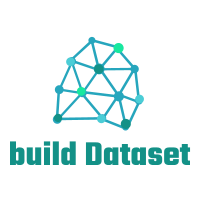

<div id="top"></div>
<!--
*** Thanks for checking out the Best-README-Template. If you have a suggestion
*** that would make this better, please fork the repo and create a pull request
*** or simply open an issue with the tag "enhancement".
*** Don't forget to give the project a star!
*** Thanks again! Now go create something AMAZING! :D
-->


<!-- PROJECT SHIELDS -->
<!--
*** I'm using markdown "reference style" links for readability.
*** Reference links are enclosed in brackets [ ] instead of parentheses ( ).
*** See the bottom of this document for the declaration of the reference variables
*** for contributors-url, forks-url, etc. This is an optional, concise syntax you may use.
*** https://www.markdownguide.org/basic-syntax/#reference-style-links
-->
[](https://github.com/veraposeidon/labelme2Datasets/actions/workflows/pylint.yml)
[](https://codebeat.co/projects/github-com-veraposeidon-labelme2datasets-opensourcejourney)
[![chinese][zh-sheild]][zh-url]
<br />
[![Contributors][contributors-shield]][contributors-url]
[![Forks][forks-shield]][forks-url]
[![Stargazers][stars-shield]][stars-url]
[![Issues][issues-shield]][issues-url]
[![MIT License][license-shield]][license-url]


<!-- PROJECT LOGO -->
<br />

<div align="center">
  <a href="https://github.com/veraposeidon/labelme2Datasets">
    
  </a>

<h3 align="center">labelme2Datasets</h3>

  <p align="center">
    用于将 LabelMe 标注的数据转换为 VOC 格式和 COCO 格式的数据集。
    <br />
    <a href="https://github.com/veraposeidon/labelme2Datasets/issues">Report Bug</a>
    ·
    <a href="https://github.com/veraposeidon/labelme2Datasets/issues">Request Feature</a>
  </p>
</div>


[English README Available](https://github.com/veraposeidon/labelme2Datasets//blob/opensourceJourney/README.md)

<!-- TABLE OF CONTENTS -->
<details>
  <summary>Table of Contents</summary>
  <ol>
    <li>
      <a href="#about-the-project">About The Project</a>
      <ul>
        <li><a href="#built-with">Built With</a></li>
      </ul>
    </li>
    <li>
      <a href="#getting-started">Getting Started</a>
      <ul>
        <li><a href="#prerequisites">Prerequisites</a></li>
        <li><a href="#installation">Installation</a></li>
      </ul>
    </li>
    <li><a href="#usage">Usage</a></li>
    <li><a href="#roadmap">Roadmap</a></li>
    <li><a href="#contributing">Contributing</a></li>
    <li><a href="#license">License</a></li>
    <li><a href="#contact">Contact</a></li>
    <li><a href="#acknowledgments">Acknowledgments</a></li>
  </ol>
</details>


<!-- ABOUT THE PROJECT -->
## About The Project

仓库中的脚本用于将 [labelme](https://github.com/wkentaro/labelme) 标注的数据转换为 [PASCAL VOC](http://host.robots.ox.ac.uk/pascal/VOC/) 格式和 [MS COCO](https://cocodataset.org/#home) 格式的数据集，便于直接利用支持这两种格式的框架进行训练。

脚本都使用 [Python](https://www.python.org/) 写的。

大部分的脚步都是参考的 labelme 项目中的 [examples](https://github.com/wkentaro/labelme/tree/main/examples) 内容。然后添加一些根据自己的数据集自定义的功能，比如标签转换、自定义图像名称等。

**注意**：这些脚本其实并不复杂，有 Python 基础的同学可以过一遍转换的流程，确保在你的数据集上是可以正常运行的。有一些地方我标注了 `MARK`，表示在这些地方需要留意，可以根据自己的需要进行修改。

**拓展**：这些脚本当时只是用来转换我自己的数据集。如果你需要转换其他领域的数据集，比如实例分割、语义分割或者视频标注等等。建议去 lebelme 的 [examples](https://github.com/wkentaro/labelme/tree/main/examples) 部分看看，作者提供了一些示例代码，可以参考。

<p align="right">(<a href="#top">back to top</a>)</p>


### Built With

* [Python](https://www.python.org/)
* [labelme](https://github.com/wkentaro/labelme)
* [imgviz](https://github.com/wkentaro/imgviz)

<p align="right">(<a href="#top">back to top</a>)</p>


<!-- GETTING STARTED -->
## Getting Started

### Prerequisites

1. 将 lebelme 标注得到的 JSON 文件放在一个文件夹内。举个例子，命名为 `labelme_jsons_dir`。

2. 准备好一份 text 文本，里面包含数据集的分类标签。举个例子，命名为  `label_names.txt`。可以参考下项目里的 `test/label_names.txt`。

3. 如果有转换标签的需求（比如中文标签转为英文），准备一个文本，包含转换的规则，举个例子，命名为`label_dict.txt`。可以参考下项目里的 `test/label_dict.txt` 。
### Installation
1. 建议使用虚拟环境安装 Python Package。
  
    ```sh
    conda create --name=labelme python=3.6
    conda activate labelme
    pip install -r requirements.txt
    ```
2. 克隆仓库。
    ```sh
    git clone git@github.com:veraposeidon/labelme2Datasets.git
    ```

<p align="right">(<a href="#top">back to top</a>)</p>


<!-- USAGE EXAMPLES -->
## Usage

- 转换单个 JSON 文件。 (`labelme_json2dataset.py`)
    ```sh
    python labelme_json2dataset.py --json_file=data/test.json \
      --output_dir=output/test_single_output
    ```

- 转换 JSON 文件夹`labelme_jsons_dir` 到  VOC 格式的数据集。 (`labelme_bbox_json2voc.py`)
  - 需要标签转换
    ```sh
    python labelme_bbox_json2voc.py --json_dir=data/test_jsons \
      --output_dir=output/test_voc_output --labels data/label_names.txt
    ```
  - 不需要标签转换
    ```sh
    python labelme_bbox_json2voc.py --json_dir=data/test_jsons \
      --output_dir=output/test_voc_output \
      --labels data/label_names.txt \
      --label_dict data/label_dict.txt
    ```

<p align="right">(<a href="#top">back to top</a>)</p>


<!-- ROADMAP -->
## Roadmap

- [ ] 将所有的脚本都通过 Pylint
- [ ] 中英文 README
- [ ] 调整项目结构
- [ ] 发布 Pypi 包

See the [open issues](https://github.com/veraposeidon/labelme2Datasets/issues) for a full list of proposed features (and known issues).

<p align="right">(<a href="#top">back to top</a>)</p>


<!-- CONTRIBUTING -->
## Contributing

如果你有什么建议可以让这个项目变得更好，可以 Fork 项目并且提交 Pull Request。
也可以简单地在 [issues](https://github.com/veraposeidon/labelme2Datasets/issues) 中开一个 issue。

1. Fork the Project
2. Create your Feature Branch (`git checkout -b feature/AmazingFeature`)
3. Commit your Changes (`git commit -m 'Add some AmazingFeature'`)
4. Push to the Branch (`git push origin feature/AmazingFeature`)
5. Open a Pull Request

<p align="right">(<a href="#top">back to top</a>)</p>


<!-- LICENSE -->
## License

Distributed under the MIT License. See `LICENSE` for more information.

<p align="right">(<a href="#top">back to top</a>)</p>


<!-- CONTACT -->
## Contact

veraposeidon - veraposeidon@gmail.com

Project Link: [https://github.com/veraposeidon/labelme2Datasets](https://github.com/veraposeidon/labelme2Datasets)

<p align="right">(<a href="#top">back to top</a>)</p>


<!-- ACKNOWLEDGMENTS -->
## Acknowledgments

* [labelme](https://github.com/wkentaro/labelme)
* [labelme2coco](https://github.com/fcakyon/labelme2coco)

<p align="right">(<a href="#top">back to top</a>)</p>


<!-- MARKDOWN LINKS & IMAGES -->
<!-- https://www.markdownguide.org/basic-syntax/#reference-style-links -->
[zh-sheild]:https://img.shields.io/badge/language-chinese-red
[zh-url]:https://github.com/veraposeidon/labelme2Datasets//blob/opensourceJourney/README.zh.md
[contributors-shield]: https://img.shields.io/github/contributors/veraposeidon/labelme2Datasets.svg?style=for-the-badge
[contributors-url]: https://github.com/veraposeidon/labelme2Datasets/graphs/contributors
[forks-shield]: https://img.shields.io/github/forks/veraposeidon/labelme2Datasets.svg?style=for-the-badge
[forks-url]: https://github.com/veraposeidon/labelme2Datasets/network/members
[stars-shield]: https://img.shields.io/github/stars/veraposeidon/labelme2Datasets.svg?style=for-the-badge
[stars-url]: https://github.com/veraposeidon/labelme2Datasets/stargazers
[issues-shield]: https://img.shields.io/github/issues/veraposeidon/labelme2Datasets.svg?style=for-the-badge
[issues-url]: https://github.com/veraposeidon/labelme2Datasets/issues
[license-shield]: https://img.shields.io/github/license/veraposeidon/labelme2Datasets.svg?style=for-the-badge
[license-url]: https://github.com/veraposeidon/labelme2Datasets/blob/opensourceJourney/LICENSE
[product-screenshot]: images/screenshot.png
